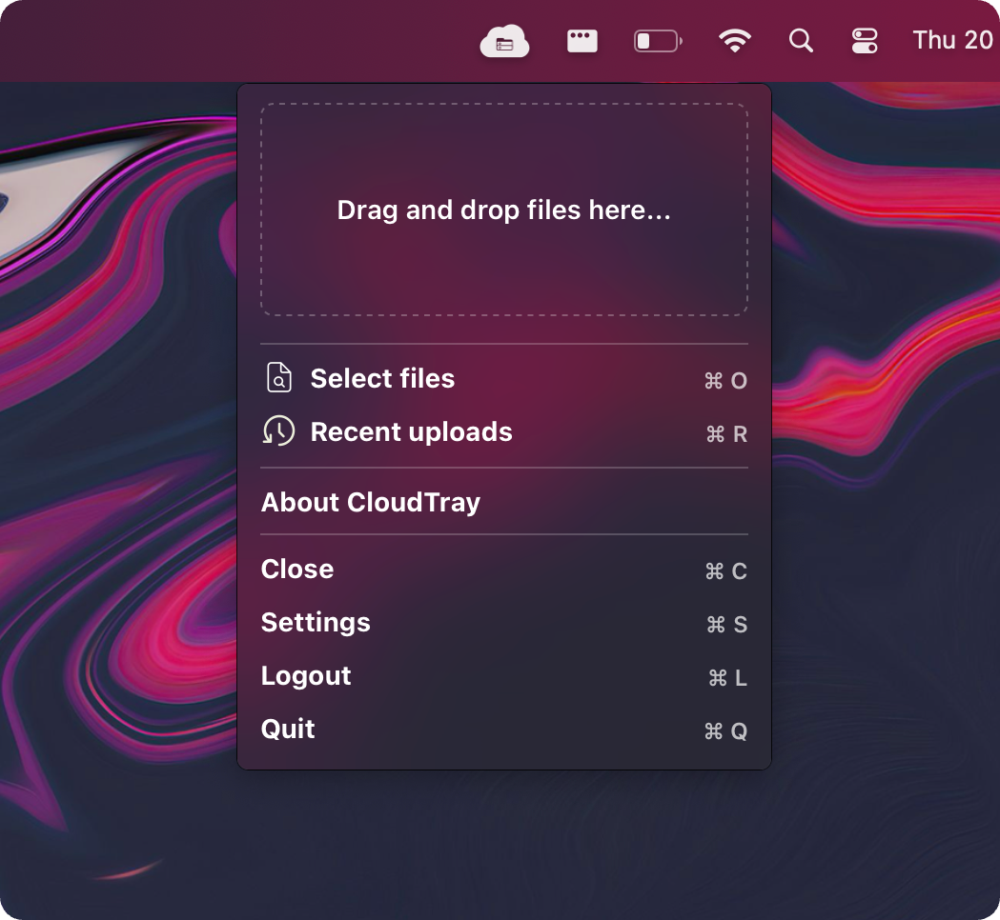
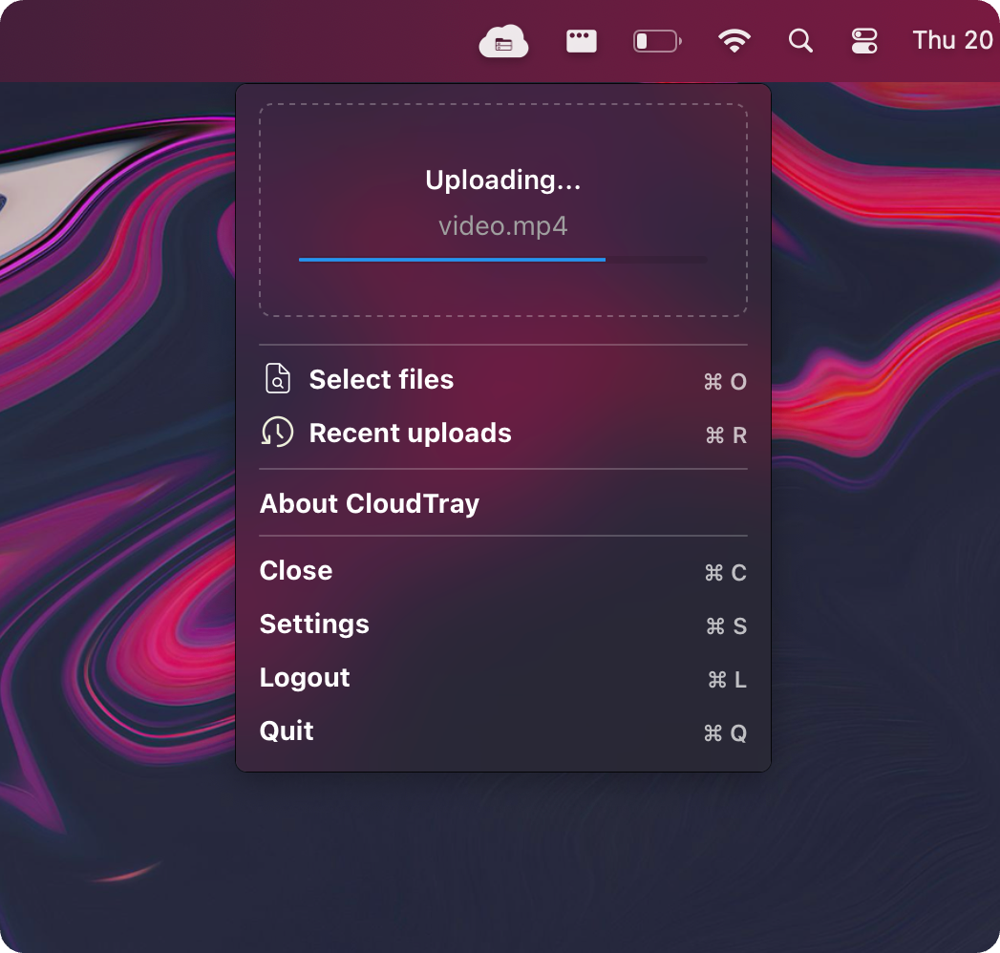
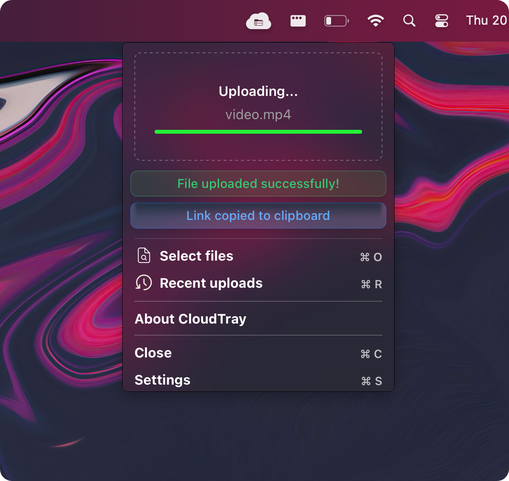
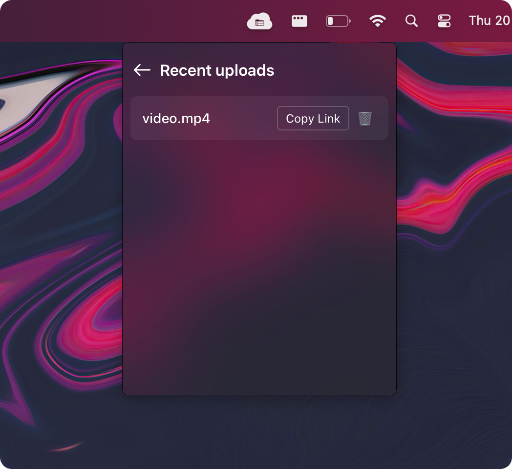

<div>
<h3>CloudTray 🚀☁️</h3>
<p>📂 Compartilhe arquivos de forma rápida e prática com integração ao Google Drive!</p>
</div>

<br/><br/>

<br />

## Índice
- 📌 [Sobre o Projeto](#sobre-o-projeto)
- 📸 [Interface](#interface)
- ✨ [Recursos](#recursos)
- 🖥️ [Instalação](#instalação)
- ⚙️ [Como Usar](#como-usar)
- 🔧 [Configuração](#configuração)
- 📦 [Tecnologias Utilizadas](#tecnologias-utilizadas)
- 🤝 [Contribuindo](#contribuindo)
- 📩 [Contato](#contato)

<br />

## 📌 Sobre o Projeto <a name=sobre-o-projeto><a/>
O CloudTray é um aplicativo desktop minimalista que permite fazer upload e compartilhar arquivos de forma rápida e prática, diretamente da bandeja do sistema. Ele integra-se ao Google Drive para simplificar o gerenciamento de arquivos na nuvem.
<br />
O projeto foi baseado no [app desktop](https://www.youtube.com/watch?v=IN1zI7C8ER4) desenvolvido pelo [Diego Fernandes](https://github.com/diego3g), apenas mudando alguns aspectos para que tenha uma integração mais simples e fácil de qualquer usuário configurar.

<br />

## 📸 Interface

<div align="center">
  <table>
    <tr>
      <td align="center" width="50%">
        
        <p><em>Interface principal do app</em></p>
      </td>
      <td align="center" width="50%">
        
        <p><em>Progresso do upload de arquivos</em></p>
      </td>
    </tr>
    <tr>
      <td align="center" width="50%">
        
        <p><em>Confirmação de upload bem-sucedido</em></p>
      </td>
      <td align="center" width="50%">
        
        <p><em>Lista de uploads recentes com opção de copiar link</em></p>
      </td>
    </tr>
  </table>
</div>

<br />

## ✨ Recursos <a name=recursos><a/>
✔️ Upload rápido para o Google Drive
<br />
✔️ Compartilhamento fácil de arquivos
<br />
✔️ Interface simples e minimalista na bandeja do sistema
<br />
✔️ Suporte a links temporários para compartilhamento
<br />
✔️ Configuração simples e segura

<br />

## 🖥️ Instalação <a name=instalação><a/>
🔹 Windows

1. Baixe o instalador do [release mais recente](https://github.com/EmanoelLoreto/CloudTray/releases).
2. Execute o arquivo .exe e siga as instruções.
3. O CloudTray será iniciado automaticamente na bandeja do sistema.

<br />

🔹 Linux

1. Baixe o pacote .AppImage ou .deb do [release mais recente](https://github.com/EmanoelLoreto/CloudTray/releases).
2. No terminal, conceda permissão de execução:
```console
chmod +x CloudTray.AppImage
```
3. Execute o aplicativo:
```console
./CloudTray.AppImage
```

<br />

🔹 Mac

1. Baixe o instalador do [release mais recente](https://github.com/EmanoelLoreto/CloudTray/releases).
2. Execute o arquivo .dmg e siga as instruções.
3. O CloudTray será iniciado automaticamente na bandeja do sistema.

<br />

## ⚙️ Como Usar <a name=como-usar><a/>

1. Clique no ícone do CloudTray na bandeja do sistema.
2. Faça login com sua conta do Google Drive.
3. Arraste e solte arquivos para fazer upload.
4. Copie o link gerado e compartilhe com facilidade.

<br />

## 🔧 Configuração <a name=configuração><a/>
O CloudTray permite algumas configurações personalizadas, como:

- Definir tempo de expiração do link
- Alternar o idioma entre Português e Inglês
<!-- - Ativar/desativar notificações -->

Acesse as configurações pelo ícone na bandeja do sistema.

<br />

## 📦 Tecnologias Utilizadas <a name=tecnologias-utilizadas><a/>
Tauri – Para criar a interface desktop leve e rápida
<br />
Rust – Para a parte nativa, integração com o sistema operacional e backend
<br />
React – Para a construção da interface do usuário
<br />
Google Drive API – Para integração com a nuvem

<br />

## 🤝 Contribuindo <a name=contribuindo><a/>
Quer ajudar a melhorar o CloudTray? Siga os passos abaixo:

1. Faça um fork do repositório
2. Crie uma branch com sua feature (git checkout -b minha-feature)
3. Faça o commit das mudanças (git commit -m "Adicionei uma nova feature")
4. Faça um push para a branch (git push origin minha-feature)
5. Abra um Pull Request 🚀☁️

<br />

## 📩 Contato <a name=contato><a/>
📧 Email: [emanoelloreto@hotmail.com](mailto:emanoelloreto@hotmail.com)
<br />
🐙 GitHub: [EmanoelLoreto](https://github.com/EmanoelLoreto)

Se tiver dúvidas ou sugestões, sinta-se à vontade para abrir uma issue! 😊
